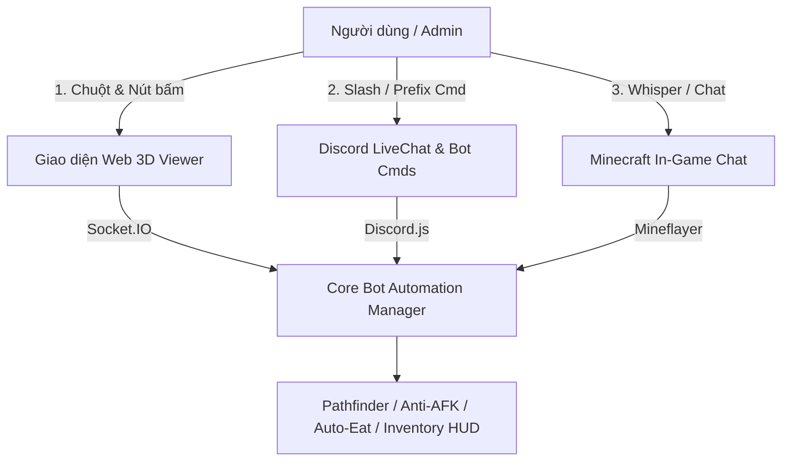

# Kế hoạch & Roadmap: Click-to-Move, Smart Anti-AFK & Auto-Eat Modules

Tài liệu này chi tiết hóa kiến trúc, giải pháp kỹ thuật và danh sách công việc (Checklist / TODO) cho các module tự động hóa sinh tồn và điều khiển trực quan dành riêng cho bot Anarchy Minecraft.
| Module | Mục đích & Phạm vi | Thư viện / Công nghệ | Trạng thái |
| :--- | :--- | :--- | :--- |
| **Click-to-Move** | Nhấp chuột trên Web 3D Viewer để điều khiển bot tự động tìm đường đi tới vị trí đích | `mineflayer-pathfinder`, `prismarine-viewer`, Socket.IO | ✅ Đã hoàn thành (Production-ready) |
| **Smart Anti-AFK** | Thực hiện chuỗi hành vi ngẫu nhiên mô phỏng người chơi thật, chống kick AFK server | Mineflayer control states, EventEmitter, Randomizer | ✅ Đã hoàn thành (Feature-based) |
| **Auto-Eat & Totem** | Tự động chọn thức ăn tối ưu và ăn khi đói hoặc mất máu, ưu tiên giữ Totem | Mineflayer inventory & item usage, food values | ✅ Đã hoàn thành (Production-ready) |
| **Web 3D HUD & Inventory** | Giao diện kính mờ Glassmorphism HUD xem 36 slot balo, giáp, offhand, tooltip enchant | Vanilla CSS Glassmorphism, Socket.IO, Prismarine-Viewer | ✅ Đã hoàn thành (Production-ready) |

---

## 2. Thiết kế Kỹ thuật Chi tiết

### Module 1: Smart Pathfinder & Highway Navigation Engine (Lấy cảm hứng từ cơ chế Moving của [HighwayBot](https://github.com/paithon5959/HighwayBot))

Hệ thống điều hướng thông minh tập trung **thuần túy vào cơ chế Di Chuyển (Moving & Navigation)** an toàn, nhanh chóng trên địa hình Anarchy và các trục cao tốc Nether (chỉ di chuyển/chạy bám đường, **không** xây dựng/đào bới mở đường dạng Highway Builder).

* **Các cơ chế cốt lõi (Core Moving Mechanisms)**:
  1. **Bám trục Cao tốc Nether/Overworld (Highway Auto-Centering & Alignment)**:
     - Nhận diện và tự động căn giữa vào làn đường cao tốc chính ($+X, -X, +Z, -Z$) hoặc đường chéo ($++, +-, -+, --$).
     - Tối ưu hóa tốc độ di chuyển thẳng (Sprint-jumping, chạy bám dải băng xanh Blue Ice / Packed Ice / đường phẳng).
  2. **Long-Distance Waypoint Pathfinding**:
     - Chia nhỏ quãng đường di chuyển xa thành từng chặng mốc (Waypoints) liên tiếp, nạp và giải phóng linh hoạt để di chuyển mượt mà không gây lag.
  3. **Né tránh Nguy hiểm & Bẫy Anarchy (Danger & Portal Avoidance)**:
     - Tự động tránh các khối dung nham (Lava), hố sâu nguy hiểm hoặc bẫy lún Soul Sand / Cobweb làm kẹt nhân vật.
     - **Portal Avoidance**: Chủ động né tránh không bước vào các cổng Nether Portal dọc đường cao tốc (tránh bị kẹt hoặc dịch chuyển ngoài ý muốn).
  4. **Phanh Khẩn Cấp & Dừng An Toàn (`stop` command)**:
     - Hủy ngay lập tức mục tiêu di chuyển, nhả toàn bộ phím điều hướng, phanh hãm và giữ thăng bằng tại khối an toàn gần nhất.

* **Luồng tích hợp Click-to-Move trên Web 3D Viewer**:
  1. Người dùng mở `http://localhost:3007/viewer/:serverId`.
  2. Khi nhấp chuột trái vào một khối block trên bản đồ 3D:
     - Client `prismarine-viewer` phát sự kiện `blockClicked` kèm tọa độ `(x, y, z)` và mặt block `face`.
  3. Server nhận sự kiện qua Socket.IO:
     - Gọi `SmartPathfinderService.moveTo(x, y, z)`.
     - Cấu hình `Movements` thuần di chuyển an toàn (`allowParkour = true`, `canDig = false`, `liquidCost = 50`).
  4. **Phản hồi trực quan (Visual Feedback)**:
     - Vẽ đường đi dự tính (polyline 3D màu xanh neon) trên Web Viewer từ vị trí hiện tại của bot đến điểm đích.
     - Xóa đường vẽ khi bot đã đến đích hoặc khi nhận lệnh hủy (`stop`).

---

## 2. Thiết kế Kỹ thuật Chi tiết (Anti-AFK, Auto-Eat, HUD)

### Module 2: Smart Anti-AFK Engine
* **Đặc tính kỹ thuật**:
  - Không đi theo quỹ đạo cố định (đường thẳng/vòng lặp cứng) để tránh bị plugin Anti-AFK hiện đại phát hiện.
  - Kết hợp ngẫu nhiên các hành động tự nhiên:
    - **Xoay góc nhìn (Camera Rotation)**: Xoay `yaw` và `pitch` ngẫu nhiên nhẹ nhàng $\pm 15^\circ - 45^\circ$.
    - **Di chuyển vi mô (Micro-stepping)**: Bước lên 1 bước, lùi 1 bước, hoặc bước sang trái/phải trong phạm vi an toàn 1-2 block.
    - **Hành động cơ bản (Action Emulation)**: Vung tay (`bot.swingArm()`), ngồi xổm ngắn (`bot.setControlState('sneak', true)`), nhảy (`bot.setControlState('jump', true)`).
* **Kiểm tra an toàn (Safety Guard)**:
  - Kiểm tra block dưới chân: Không bước ra khỏi mép vực (Fall damage) hoặc mép hồ dung nham/nước.
  - Tự động tạm dừng Anti-AFK khi bot đang thực hiện lệnh di chuyển (Pathfinder) hoặc đang ăn (Auto-Eat).
  - Tự động kích hoạt sau khi bot đứng yên không có hành động nào trong `IDLE_TIMEOUT` (ví dụ: 60 giây).

---

### Module 3: Auto-Eat & Smart Food Manager
* **Đặc tính kỹ thuật**:
  - Lắng nghe sự kiện `health` và `food` của bot:
    - Kích hoạt ăn khi `bot.food < 16` (hoặc `bot.health < 18` khi cần hồi máu nhanh).
  - **Bảng ưu tiên thức ăn (Food Priority)**:
    1. *Golden Carrot* (Độ bão hòa cao nhất - Saturation).
    2. *Cooked Beef / Cooked Porkchop* (Hồi phục tốt).
    3. *Bread / Baked Potato / Cooked Mutton*.
    4. *Enchanted Golden Apple / Golden Apple* (Chỉ kích hoạt khẩn cấp khi `bot.health <= 8` hoặc có cảnh báo nguy hiểm).
* **Quy trình ăn an toàn (Safe Eating Routine)**:
  1. Lưu lại item đang cầm ở Main Hand.
  2. Tạm dừng di chuyển hoặc chạy bộ.
  3. Tìm kiếm thức ăn tốt nhất trong inventory và trang bị vào Main Hand: `bot.equip(foodItem, 'hand')`.
  4. Kích hoạt giữ chuột phải để ăn: `bot.consume()`.
  5. Khi ăn xong: Tự động đổi lại vũ khí/công cụ ban đầu vào Main Hand.
  6. **Đảm bảo Offhand Totem**: Kiểm tra và tự động lắp lại *Totem of Undying* vào tay phụ (`offhand`) nếu bị thiếu.

---

### Module 4: Web 3D Inventory HUD Overlay & Live Tooltips (Xem Kho Đồ Trực Quan)

Module bổ sung một giao diện kính mờ (Glassmorphism HUD) trực tiếp trên Web 3D Viewer giúp người dùng theo dõi toàn bộ vật phẩm trong balo của bot mà không cần vào game.

* **Đặc tính kỹ thuật**:
  - **Bố cục Lưới Kho Đồ Chuẩn Minecraft (Grid Layout)**:
    - 4 ô Giáp (Mũ, Áo, Quần, Giày) & 1 ô Tay phụ (Offhand - Totem/Shield).
    - 27 ô Balo chính (Main Inventory) + 9 ô Hotbar.
    - Hiển thị sprite/icon vật phẩm 2D sắc nét, số lượng đè góc (`x64`, `x16`) và thanh độ bền màu sắc (Xanh lá $\rightarrow$ Đỏ).
  - **Bật / Tắt Linh Hoạt (Toggle On/Off)**:
    - Nút bấm `🎒 Kho đồ` trên góc điều khiển hoặc phím tắt **`E`** trên bàn phím.
    - Tự động ghi nhớ trạng thái đóng/mở vào `localStorage` của trình duyệt.
  - **Live Tooltip & Enchantment Inspector (Rê chuột xem chi tiết)**:
    - Rê chuột qua bất kỳ slot đồ nào sẽ hiện tooltip Minecraft chuẩn:
      - Tên vật phẩm (màu theo độ hiếm/custom name).
      - Danh sách Phù phép (Enchantments: *Protection IV*, *Unbreaking III*, *Mending*...).
      - Chỉ số độ bền còn lại (ví dụ: `Độ bền: 428 / 528`).
    - **Mẹo Sử Dụng Thông Minh (Smart Usage Tips)**: Gợi ý nhanh công dụng (ví dụ: *"Totem of Undying: Đang được Auto-Eat/Keeper ưu tiên giữ ở tay phụ"*).
  - **Cập nhật Real-Time qua WebSocket**: Lắng nghe packet `inventory_update` từ bot mỗi khi nhặt đồ, đổi tay, ăn đồ hoặc dùng totem.

---

## 3. Hướng dẫn Thao tác & Cách Sử dụng (Controls & Operations)

Hệ thống cho phép người dùng và quản trị viên điều khiển, giám sát các module thông qua **3 giao diện linh hoạt**:

### 3.1. Thao tác trên Web 3D Viewer (`http://localhost:3007/viewer/:serverId`)

| Thao tác | Hành động & Chức năng | Phản hồi trên giao diện |
| :--- | :--- | :--- |
| **Click chuột trái vào Block** | Ra lệnh **Click-to-Move**: Bot tự tìm đường đi an toàn đến mặt khối block vừa click. | Xuất hiện cột mốc đánh dấu (Marker) và vẽ đường đi 3D (Polyline xanh neon). |
| **Chuột trái + Kéo (Drag)** | Xoay góc nhìn camera 360 độ xung quanh bot. | Xoay mượt mà theo thời gian thực. |
| **Chuột phải + Kéo (Right Drag)** | Pan camera (di chuyển vùng quan sát sang trái/phải/lên/xuống). | Di chuyển khung nhìn mà không làm thay đổi vị trí bot. |
| **Lăn chuột (Scroll Wheel)** | Phóng to (Zoom In) / Thu nhỏ (Zoom Out) tầm nhìn thế giới. | Tăng giảm khoảng cách camera đến bot. |
| **Nút 🛑 Dừng di chuyển (Stop)** | Hủy ngay lập tức mục tiêu Pathfinder hiện tại khi gặp nguy hiểm (dung nham, quái, player). | Xóa đường vẽ 3D, bot dừng bước ngay lập tức. |
| **Nút 🎒 Bật/Tắt Kho đồ (Phím `E`)** | Ẩn hoặc hiện bảng lưới Inventory HUD góc màn hình (Giáp, Hotbar, Balo, Offhand). | Bảng balo trượt mở mượt mà kèm hiệu ứng kính mờ (Glassmorphism). |
| **Rê chuột vào Slot đồ (Hover)** | Xem chi tiết thông tin item, enchantments, độ bền và mẹo sử dụng. | Xuất hiện khung Tooltip Minecraft chi tiết. |
| **Nút 🔄 Đổi góc nhìn (Cam Mode)** | Chuyển đổi giữa **Góc nhìn thứ nhất** (First-Person) và **Góc nhìn tự do** (Free Orbit). | Chuyển góc nhìn camera tức thì. |
| **Nút 💤 Toggle Anti-AFK** | Bật hoặc tắt nhanh chế độ Smart Anti-AFK trực tiếp từ Web. | Đèn trạng thái chuyển `Xanh (Active)` / `Xám (Off)`. |
| **HUD Thông số góc màn hình** | Hiển thị trực tiếp: Máu (❤️), Đói (🍖), Số Totem còn lại, Thức ăn đang cầm, Tọa độ hiện tại. | Cập nhật real-time qua WebSocket. |

---

### 3.2. Thao tác qua Lệnh Discord (Discord Slash & Prefix Commands)

* **Điều khiển di chuyển thông minh (Smart Pathfinder / Movement)**:
  * `>goto x:<số> [y:<số>] z:<số>` hoặc `>goto <x> [y] <z>`: Ra lệnh bot di chuyển thông minh đến tọa độ mục tiêu (tự động tính toán cao độ Y an toàn nếu bỏ trống).
  * `>highway axis:<+X|-X|+Z|-Z|++|+-|-+|--> target:<số>` hoặc `>highway <trục> <tọa_độ_đích>`: Kích hoạt chế độ bám đường cao tốc Anarchy (ví dụ: `>highway +X 50000` hoặc `>highway ++ 100000`).
  * `>stop` hoặc `>stop`: Dừng khẩn cấp mọi hành vi di chuyển, hủy pathfinder và lùi vào khối an toàn.
* **Quản lý Anti-AFK**:
  * `>antiafk mode:<on|off>` hoặc `>antiafk <on|off>`: Bật/tắt tự động chống kick AFK.
* **Quản lý Sinh tồn & Thức ăn (Auto-Eat & Totem)**:
  * `>autoeat mode:<on|off>` hoặc `>autoeat <on|off>`: Bật/tắt chế độ tự động ăn.
  * `>eat`: Ép bot tìm và ăn thức ăn ngay lập tức nếu túi đồ có sẵn.
  * `>totem`: Ép bot kiểm tra balo và lắp *Totem of Undying* vào tay phụ (`offhand`).

---

### 3.3. Thao tác qua In-Game Chat / Whisper (Dành cho Admin/Whitelisted Players)

* `!goto <x> [y] <z>`: Yêu cầu bot tự tìm đường đi tới tọa độ `(X, Y, Z)`.
* `!highway <+X|-X|+Z|-Z> <tọa_độ>`: Tự động chạy bám theo trục cao tốc chính đến mốc chỉ định (ví dụ: `!highway +X 10000`).
* `!follow <tên_player>`: Yêu cầu bot đi theo sau bảo vệ người chơi chỉ định.
* `!stop`: Hủy mục tiêu di chuyển, phanh và đứng yên an toàn.
* `!eat`: Ép bot ăn ngay lập tức.
* `!totem`: Ép bot trang bị lại Totem of Undying vào tay phụ.
* `!antiafk <on|off>`: Bật/tắt chế độ Anti-AFK in-game.

---

## 4. Checklist Công việc Triển khai (TODO)

### Giai đoạn 1: Smart Pathfinder & Highway Navigation Engine
- [x] **Smart Pathfinder Service (`src/services/SmartPathfinderService.ts`)**:
  - [x] Khởi tạo và liên kết `mineflayer-pathfinder` với từng instance `Minecraft`.
  - [x] Tích hợp giải thuật chia nhỏ mốc Waypoint đường dài (Waypoint Chunking).
  - [x] Cấu hình `Movements` thuần di chuyển an toàn (`allowParkour = true`, `canDig = false`, `liquidCost = 50`).
  - [x] Lắng nghe sự kiện `blockClicked` từ `ViewerManagerService` cho tính năng Click-to-Move.
  - [x] Xây dựng lệnh khẩn cấp `stop()` ngắt toàn bộ phím điều hướng và phanh lùi về khối an toàn.
- [x] **Highway Alignment Module (`src/services/HighwayNavigationService.ts`)**:
  - [x] Thuật toán căn giữa làn cao tốc ($+X, -X, +Z, -Z$ và trục chéo).
  - [x] Tối ưu hóa tốc độ di chuyển thẳng trên đường băng (Blue Ice sprint-jumping).
  - [x] Cơ chế né tránh bẫy Nether Portal dọc đường.
- [x] **Visual Route trên Web Viewer**:
  - [x] Phát sự kiện vẽ đường đi `path_update` qua Socket.IO tới Web Viewer.
  - [x] Thêm nút bấm `🛑 Dừng di chuyển (Emergency Stop)` trực tiếp trên Web Hub.

### Giai đoạn 2: Smart Anti-AFK Service
- [x] **Module `src/services/AntiAfkService.ts`**:
  - [x] Xây dựng bộ đếm thời gian Idle và kích hoạt các hành động ngẫu nhiên (xoay camera, micro-step, swing, sneak/jump).
  - [x] Thuật toán kiểm tra an toàn bề mặt xung quanh trước khi bước chân (tránh rơi vực/dung nham).
  - [x] Tích hợp cơ chế Pause/Resume khi bot đang di chuyển (Pathfinder) hoặc đang ăn (Auto-Eat).
  - [x] Bổ sung biến môi trường cấu hình trong `.env.prod`:
    - `ANTI_AFK_ENABLED=true`
    - `ANTI_AFK_MIN_INTERVAL=30000` (30s)
    - `ANTI_AFK_MAX_INTERVAL=90000` (90s)

### Giai đoạn 3: Auto-Eat & Totem Keeper Service
- [x] **Module `src/services/AutoEatService.ts`**:
  - [x] Quản lý danh sách ID thức ăn và trọng số dinh dưỡng (Golden Carrot > Cooked Meat > Bread > Gapple).
  - [x] Xây dựng quy trình `consume()` an toàn, chống kẹt trạng thái khi bị ngắt quãng.
  - [x] Tích hợp kiểm tra và tự động cầm Totem vào tay phụ (`offhand`).
  - [x] Bổ sung biến môi trường cấu hình trong `.env.prod`:
    - `AUTO_EAT_ENABLED=true`
    - `AUTO_EAT_THRESHOLD=16`
    - `AUTO_TOTEM_ENABLED=true`

### Giai đoạn 4: Web 3D Inventory HUD Overlay & Live Tooltips
- [x] **Giao diện Kho Đồ Web (`ViewerManagerService.ts` / Public HTML/CSS/JS)**:
  - [x] Lưới hiển thị 36 ô Balo + 4 ô Giáp + 1 ô Tay phụ với phong cách kính mờ Glassmorphism.
  - [x] Nút Toggle `🎒 Bật/Tắt Kho đồ` trên thanh công cụ và phím tắt `E`.
  - [x] Ghi nhớ trạng thái đóng/mở giao diện vào `localStorage`.
- [x] **Socket.IO Real-time Inventory Sync**:
  - [x] Lắng nghe sự kiện thay đổi đồ của bot và phát `inventory_update` qua WebSocket.
  - [x] Render thanh độ bền (durability bar) và số lượng stack cho từng ô.
- [x] **Live Tooltip & Enchantment Inspector**:
  - [x] Hiển thị Tooltip chi tiết khi rê chuột (Tên, Enchantment, Độ bền, Mẹo sử dụng).
- [x] **Tích hợp Lệnh Discord & In-Game**:
  - [x] `GotoCommand` (`>goto`, `!goto`)
  - [x] `HighwayCommand` (`>highway`, `!highway`)
  - [x] `StopCommand` (`>stop`, `!stop`)
  - [x] `AutoEatCommand` (`>autoeat`, `!autoeat`, `>eat`, `!eat`)
  - [x] `TotemCommand` (`>totem`, `!totem`)
  - [x] `AntiAfkCommand` (`>antiafk`, `!antiafk`)
  - [x] `FollowCommand` (`>follow`, `!follow`)

